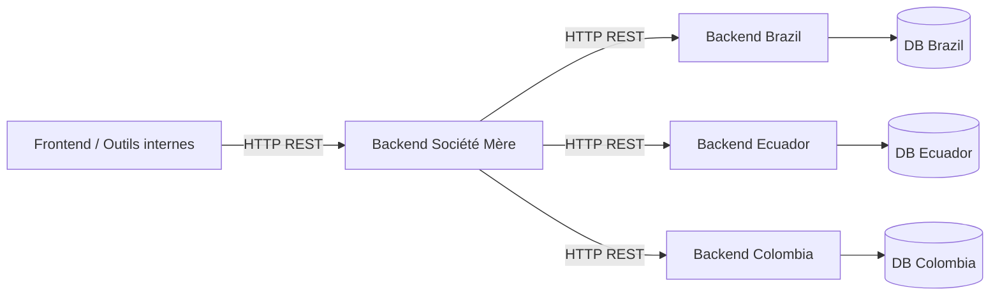

# FutureKawa - Backend Société Mère


> **Backend central FutureKawa**  
> *Expose une API unique et appelle les backends pays (Brazil / Ecuador / Colombia) comme des APIs externes.*

***

## 📋 Table des matières

- [🏢 FutureKawa - Backend Société Mère](#-futurekawa---backend-société-mère)
    - [📋 Table des matières](#-table-des-matières)
    - [🌍 Aperçu](#-aperçu)
        - [Rôle](#rôle)
    - [🏗️ Architecture globale](#️-architecture-globale)
        - [Flux fonctionnel](#flux-fonctionnel)
    - [📁 Structure du projet](#-structure-du-projet)
    - [🧱 Modèle de données](#-modèle-de-données)
        - [DTO principaux](#dto-principaux)
        - [Responses](#responses)
    - [🧩 API REST exposée](#-api-rest-exposée)
    - [⚙️ Configuration \& démarrage](#️-configuration--démarrage)
    - [🧭 Extension à d’autres pays](#-extension-à-dautres-pays)

***

## 🌍 Aperçu

### Rôle

Ce backend est le **point d’entrée unique** pour les applications FutureKawa : il expose des endpoints `/api/...` et délègue les appels vers les **backends pays** (Brazil, Ecuador, Colombia) qui jouent le rôle de “micro‑APIs” nationales.
Le backend société mère ne gère pas directement la BDD métier : il agrège et normalise les données des autres backends (entrepôts, lots, mesures, alertes, configuration) pour les frontends et outils internes.
***

## 🏗️ Architecture globale

### Flux fonctionnel



- Le **frontend** parle uniquement au backend société mère.
- Le backend société mère appelle les backends pays via des URLs configurées (`backend.brasil.url`, etc.).
- Chaque backend pays reste autonome (sa BDD, ses règles métiers), et est vu ici comme une **API externe**.

***

## 📁 Structure du projet

```bash
src/main/java/com/futurekawa/backend
├── FutureKawaBackendApplication.java
├── config
│   └── AppConfig.java
├── controller
│   ├── AlerteController.java
│   ├── ConfigurationController.java
│   ├── EntrepotController.java
│   ├── LotController.java
│   └── MesureController.java
├── enums
│   ├── AlerteType.java
│   ├── CafeType.java
│   └── LotStatut.java
├── model
│   ├── dto
│   │   ├── AlerteDto.java
│   │   ├── EntrepotDto.java
│   │   ├── LotDto.java
│   │   └── MesureDto.java
│   └── response
│       ├── AlerteResponse.java
│       ├── ConfigurationResponse.java
│       ├── EntrepotONEResponse.java
│       ├── EntrepotResponse.java
│       ├── LotResponse.java
│       └── MesureResponse.java
└── service
    ├── AlerteService.java
    ├── ConfigurationService.java
    ├── EntrepotService.java
    ├── LotService.java
    ├── MesureService.java
    └── impl
        ├── AlerteServiceImpl.java
        ├── ConfigurationServiceImpl.java
        ├── EntrepotServiceImpl.java
        ├── LotServiceImpl.java
        └── MesureServiceImpl.java
```

- **controller** : endpoints REST de haut niveau (alertes, configuration, entrepôts, lots, mesures).
- **service / impl** : logique métier + appels HTTP vers les backends pays (via `RestTemplate`).
- **model/dto** : modèles utilisés pour exposer les données de manière uniforme côté société mère.
- **model/response** : enveloppes de réponse (listes + totaux + code pays).

***

## 🧱 Modèle de données

### DTO principaux

**EntrepotDto**

```java
public class EntrepotDto {
    private Long id;
    private String nom;
    private String adresse;
    private String codePays;
    private String responsable;
    private String emailResponsable;
    private Double latitude;
    private Double longitude;
}
```

- Description d’un entrepôt consolidé (position, contact, pays).

**LotDto**

```java
public class LotDto {
    private Long id;
    private Integer entrepotId;
    private String entrepotNom;
    private CafeType typeCafe;
    private LocalDate dateStockage;
    private LotStatut statut;
    private Double poidsKg;
    private Integer joursRestants;
    private LocalDateTime dateMaj;
}
```

- Représentation d’un lot de café vue par la société mère (type, statut, poids, jours restants, etc.).

**MesureDto**

```java
public class MesureDto {
    private Long id;
    private Long espId;
    private Integer entrepotId;
    private BigDecimal temperature;
    private BigDecimal humidity;
    private LocalDateTime timestamp;
    private Boolean conforme;
}
```

- Mesure environnementale (température / humidité) pour un entrepôt.

**AlerteDto**

```java
public class AlerteDto {
    private Integer id;
    private Integer entrepotId;
    private Long lotId;
    private AlerteType type;
    private LocalDateTime dateAlerte;
    private Boolean validation;
}
```

- Alerte sur un entrepôt et/ou un lot, avec type et validation.

### Responses

Quelques exemples :

```java
public class EntrepotResponse {
    private String codePays;
    private List<EntrepotDto> entrepots;
    private long total;
}
```

```java
public class LotResponse {
    private String codePays;
    private List<LotDto> lots;
    private long total;
}
```

```java
public class ConfigurationResponse {
    private String codePays;
    private ConfigurationServiceImpl.ConfigurationDto configuration;
}
```

Ces objets permettent de retourner des listes typées + des infos globales (pays, total, …) au frontend.

***

## 🧩 API REST exposée

> Les routes sont données à titre d’exemple (elles peuvent évoluer, voir les controllers pour le détail exact).

### Configuration

```http
GET /api/{codePays}/configuration
```

- Renvoie la configuration cible (température / humidité) pour un pays.
- Pour `BR`, la config est récupérée en appelant le backend Brazil via `backend.brasil.url`.

### Entrepôts

```http
GET /api/{codePays}/entrepots
GET /api/{codePays}/entrepots/{id}
GET /api/entrepots/all
```

### Lots

```http
GET /api/{codePays}/lots
GET /api/{codePays}/lots/entrepot/{entrepotId}
GET /api/{codePays}/lots/search?lotId={lotId}
```

### Mesures

```http
GET /api/{codePays}/mesures/lot/{lotId}
```

### Alertes

```http
GET /api/{codePays}/alertes
GET /api/{codePays}/alertes/lot/{lotId}
GET /api/{codePays}/alertes/entrepot/{entrepotId}
GET /api/alertes/all
```

***

## ⚙️ Configuration & démarrage

### Propriétés

Dans `application.properties` (exemple minimal) :

```properties
server.port=8080

# URL du backend Brazil (appelé comme une API externe)
backend.brasil.url=http://localhost:8081
```

`ConfigurationServiceImpl` montre comment `backend.brasil.url` est utilisé pour appeler `/api/configuration` du backend Brazil lorsque `codePays = "BR"`. Pour `EC` et `CO`, la configuration est calculée dans le service central.

***

## 🧭 Extension à d’autres pays

Pour ajouter un nouveau pays (ex. `MX`) :

1. Ajouter une propriété d’URL si un backend pays existe (ex. `backend.mexico.url`).
2. Étendre les services (`ConfigurationServiceImpl`, `EntrepotServiceImpl`, etc.) pour router selon `codePays`.
3. Réutiliser les mêmes DTO / responses : le frontend continue à consommer une API homogène, quel que soit le pays.